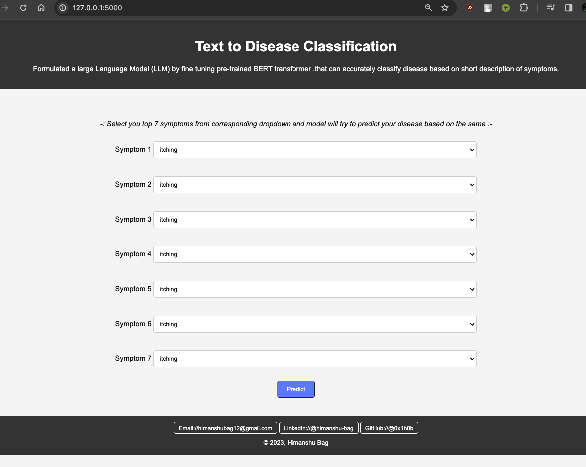
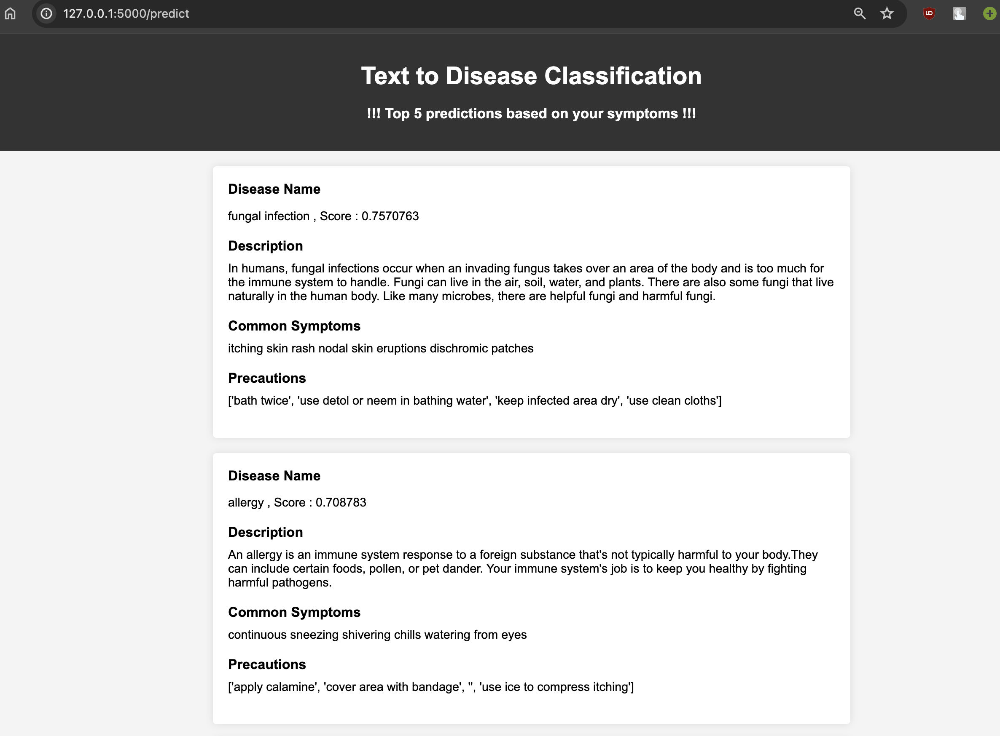

# Text-to-Disease-Classification

Formulated a large Language Model (LLM) by fine tuning pre-trained BERT transformer ,that can accurately classify disease name based on short description of symptoms.

Deployed this system as a Flask-based web application, ensuring seamless accessibility and user-friendly interaction.



## Installation

Create a conda environment using environment file , activate that environment and the run the app.py file.
if run sucessfully, you should be able to access the web app at localhost.

Example:-   
```
# clone repo
git clone git@github.com:0x1h0b/Text-to-Disease-Classification.git

# create environment
conda env create --name <envname> --file=environments.yml

# activate env
conda activate <envname>

# run app.py
python app.py

```

## Data

Used below kaggle dataset to fine tune the BERT model

Kaggle:// [disease-symptom-description-dataset](https://www.kaggle.com/datasets/itachi9604/disease-symptom-description-dataset)

#### Observations :-
    -   <will add my observation for data>

## Training & Evaluation


## Results

when you enter the top 7 symptoms in the flask web app , it will display the top 5 disease based on the symptoms.

Here is the sample result from flask , 
